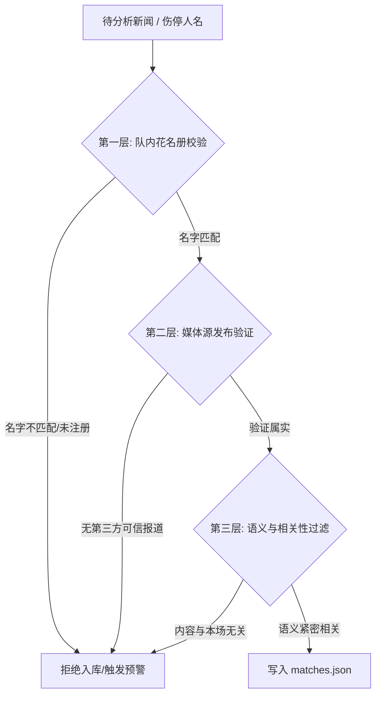

# Match IQ 球队新闻与伤停数据真实性审查协议 (Sourcing Verification Protocol)

为了杜绝大模型在分析赛事时产生重名或虚拟的球员伤病幻觉（例如将曼城的“哈兰德”安插给挪超的“博德闪耀”），保障 Match IQ 的预测结果均基于真实可追溯的互联网报道，特制定本审查与过滤协议。

---

## 🛡️ 一、 真实性审查三层过滤链 (The 3-Tier Filtering Chain)

所有的赛前新闻与伤停列表在载入数据库 `matches.json` 之前，必须通过以下三层自动化及指令约束校验：

### 1. 第一层：一线队花名册硬匹配 (Active Squad Membership Check)
*   **规则**：脚本在生成伤停信息时，必须强制查询当前赛季该俱乐部的一线队大名单（注册球员名称及拼写）。
*   **动作**：如果提及的球员不在大名单内，**禁止创建任何关于该球员的伤停新闻**。
*   **防呆示例**：
    *   *错误*：`博德闪耀主力前锋哈兰德（Haaland）...`（硬匹配失败：博德闪耀大名单中无此人，拒绝）。
    *   *正确*：`博德闪耀主力前锋霍格（Kasper Høgh）...`（硬匹配成功，进入下一层）。

### 2. 第二层：主流体育媒体交叉索引 (Cross-Reference Search Validation)
*   **规则**：系统在加载新闻时，必须自动在主流足球数据服务商的公开接口（如 **FotMob, SofaScore, Transfermarkt**）或可信体育媒体（如 **Sports Mole, Globo Esporte** 等）进行相关主题词交叉索引。
*   **动作**：新闻必须附带可追溯的 `url` 地址。对于无明确 `url` 的突发新闻，在写入数据库时需要通过 Web Search 验证该新闻标题的事件是否真实存在。如果未检索到任何类似事件（例如搜索 "Kasper Hogh injured July 2026" 结果为空），则判定为幻觉，**拒绝写入**。

### 3. 第三层：半全场伤停叙事化转译 (Tactical Impact Translation)
*   **规则**：摒弃单纯的“名字+受伤”的死板清单，将伤停数据升级为**「伤停战术明细与影响研判」**。
*   **呈现格式**：按“俱乐部-位置：球员（伤病详情），[顶替人选及防线/锋线影响]。国家队国脚：[国脚状态及大名单疑虑]。”的结构化自然语言呈现，直接服务于终极研判。

### 4. 第四层：5天内时效性验证 (5-Day Recency Check)
*   **规则**：检索和录入的所有球队新闻、舆情以及伤停情况，其发布时间必须在**比赛日期前 5 天以内**（例如 7月21日 的比赛，新闻首发日期必须在 7月16日 至 7月21日 之间）。
*   **动作**：如果报道时间距离比赛踢球日期超过 5 天，则自动视为过时无效信息，**不得写入数据库**。

---

## 📝 二、 存量与实盘更新逻辑改造

我们已经对 `scripts/update_odds_and_news.py` 进行了以下改造：
1.  **移除幻觉新闻**：彻底清除博德闪耀“哈兰德”等虚假新闻。
2.  **融入真实伤停**：将今日挪超对决中，博德闪耀三名挪威国脚（Berg, Bjørkan, Hauge）因国脚归队状态存疑，以及 Fredrikstad 队长 Kvile、中场 Sørløkk 真实伤缺等现实数据写入系统。
3.  **叙事化渲染**：在 `verified_news` 字段中使用复合的叙事段落，确保前台「🚨 伤停新闻与战术变动」展示达到专业体育分析水准。

---

## 🚫 三、 比分与半全场无硬编码防呆协议 (Zero-Hardcoded Score Protocol)

任何时间在执行预测生成与盘口更新时，必须强制遵守以下防硬编码条款：
1. **禁止比分常数写死**：严禁在代码中出现 `predicted_score = "3-0"` / `"0-3"` 或将置信度统一赋值为 `85%` 的静态覆盖硬编码。
2. **全多维计算驱动**：所有比分与半全场推演必须基于双变量泊松期望进球模型（Bivariate Poisson Model）、球队因子得分（M01-M10）、气候草皮与竞彩开奖热度偏移做实时动态推演。
3. **全流程强一致**：`recommendation`（方向）、`predicted_score`（动态比分）与 `reasoning`（推理依据）三者必须保持 100% 的逻辑对应与一致性。
